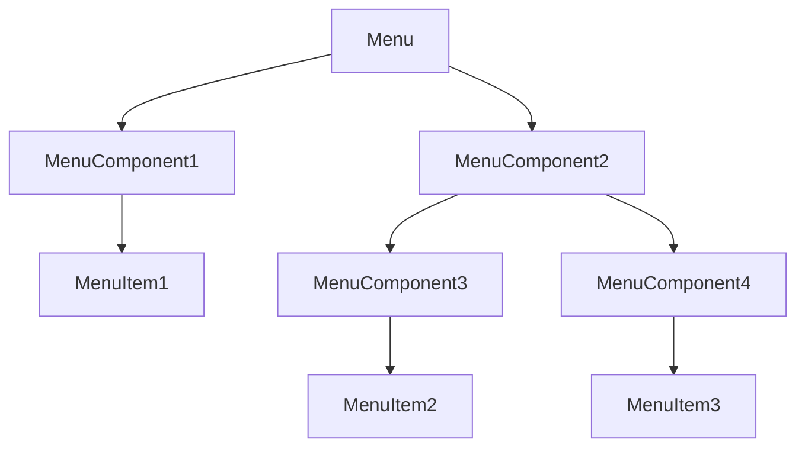
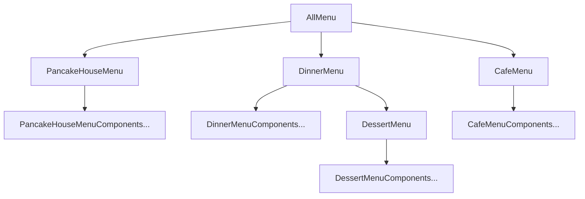

# composite

> 组合模式：允许你将对象组合成树形结构来表现“整体/部分”层次结构。组合能让客户以一致的方式处理个别对象以及对象组合。

举个例子，比如下面的Diagram，就是组合模式的树形结构。

对应实现的例子中的具体的树形结构如下：

在Go语言实现中，存在一个难点，就是要区分当前对象的iterator和composite iterator，composite iterator是要遍历整个树所有的节点，而当前对象的iterator是只需要遍历当前对象的slice内容就行。

书中配套的java例子中，由于直接使用了ArrayList，本身ArrayList就提供了iterator，所以在Go中需要自己多实现一个iterator，也就是代码中的MenuIterator。

