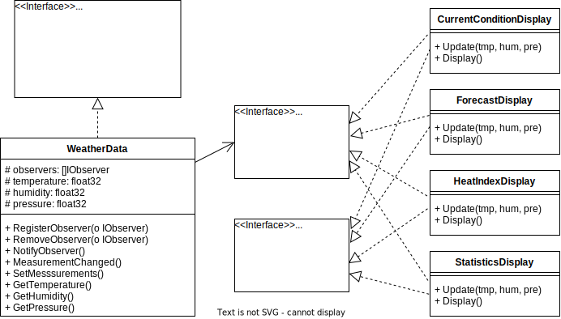

# observer

在 observer 的代码中有三份，分别是 swing、weather 和 weatherobservable 三个文件夹。

其中 swing 是一个窗口示例代码，weather 是自己实现的 observer 模式，weatherobservable 是使用 java 提供的 observer 进行实现的。

这里 Go 语言主要实现的是 observer 这个代码。

代码结构说明：
- weatherStation.go 作为客户端主函数，将数据提供方weatherStation和数据消费方不同的display写在了一起，在实际使用中二者是分开的
- display
  - 实现不同的display，每个display向weatherData注册，并实现了IObserver和IDisplayElement接口
- station
  - 具体weatherData实现，实现了ISubject接口

UML图：

