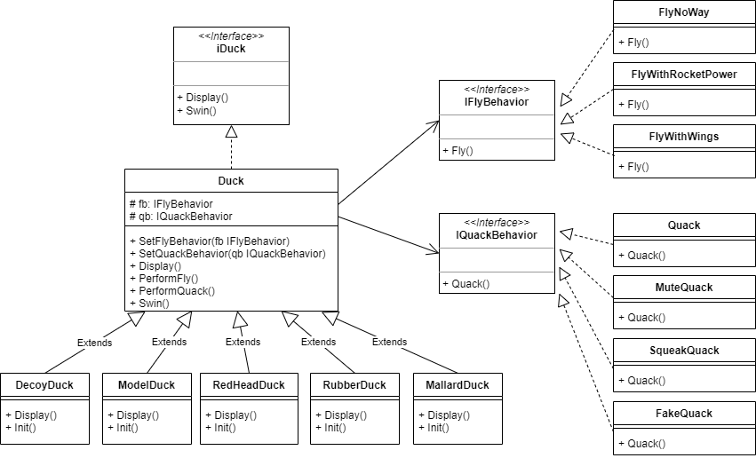

# strategy
## Go 示例代码
Go 语言版本说明：
v1版本作为示例代码，所有的文件都放在同一个目录下了。
v2版本比较接近实际场景，对内容进行了分类，看起来更清晰。

下面以v2版本代码的结构进行说明

- duck 
  - 实现鸭子的抽象，和具体的鸭子
- behavior
  - 行为的抽象，包括 fly 和 quack
    - fly
    - quack

对于 strategy 的核心要点是将一些通用的算法进行封装，然后在构建对象中保存一个算法的抽象，在实例化一个对象的时候，设置具体的算法。

在 Go 示例代码中，就是对行为 fly 和 quack 进行算法封装，实例化具体鸭子的时候，可以选择不同的算法来执行 fly 和 quack 操作。

核心要点就是 struct Duck 中加入了 IFlyBehavior 和 IQuackBehavior，同时提供了这些行为（算法）的设置函数，提供动态改变行为（算法）的能力。

UML图：

